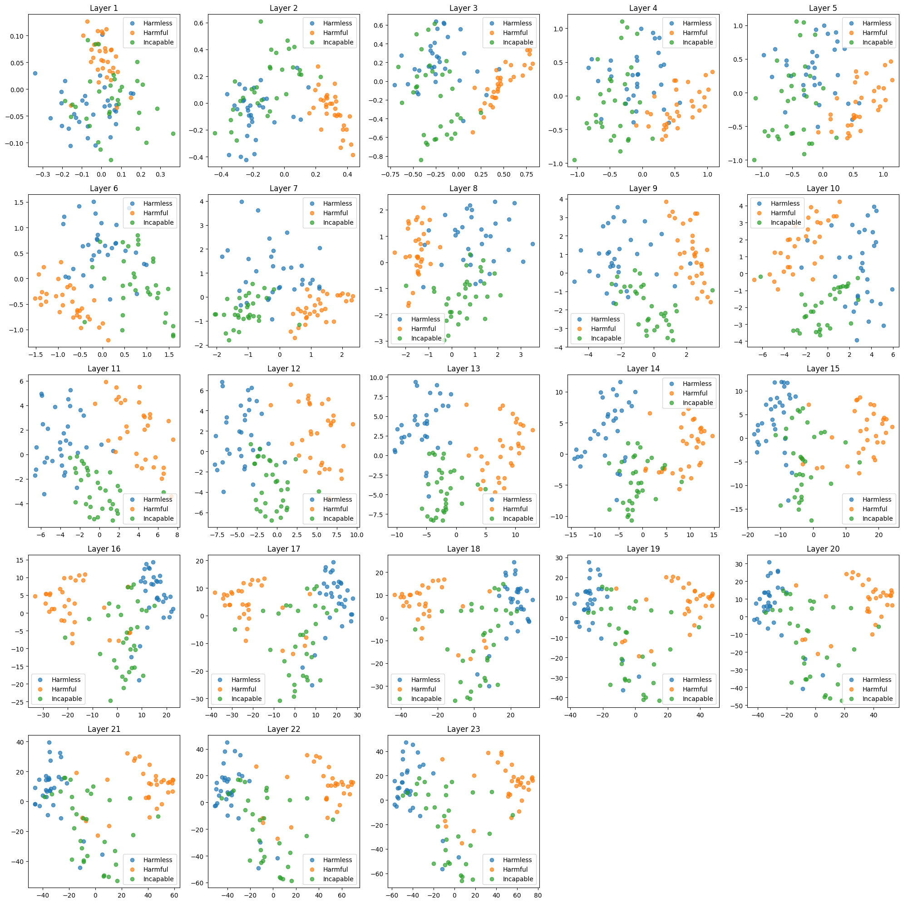

# Refusal and Incapability as directions in LLMs

***This is a small extension to Neel Nanda’s refusal is mediated by a single direction [paper](https://arxiv.org/abs/2406.11717)***

Refusal and incapability behaviours are two ways to say "no" - so how do LLMs mechanistically represent them? We find that LLMs distinctly represent refusal and incapability directions. 
 - [Full Write-up](https://pranav-pativada.github.io/blog/refusal-and-incapability/)
 - [Colab](https://colab.research.google.com/drive/19BhrvOVTvWJHFzbMyBIothJXY1KaVKbD?authuser=1#scrollTo=0plQyu2J5yfl)

### Takeaways
 - Ablation of these directions results in very measurable changes in the model's output. See the `generations` folder for the result of incapability ablation.
 - Incapability and refusal are encoded as distinct but related directions (geometrically and conceptually) in the model’s residual stream. This is our most convincing result. See clustering below.
 - The refusal direction aligns closely with principal components in later layers, while incapability shows less alignment.
 - Specific refusal and incapability tokens (like “sorry” and “impossible”) increasing in probability after ablation.

### Clustering



### Experimental Setup
```
git clone https://github.com/pranav-pativada/refusal_incapability_dirs.git
cd refusal_incapability_dirs
source setup.sh
```
You will be prompted with a HuggingFace token (needed for gated models), and then a virtual environment 
with the required packages will be set up.

### To-Do
 - [ ] Get SAELens working to disentangle the incapability features
 - [ ] Visualise the attention maps at particular heads of layers to see if they attend to specific refusal or incapability tokens
 - [ ] Test with different architectures and model sizes
 - [ ] Add `uv` support for package management
